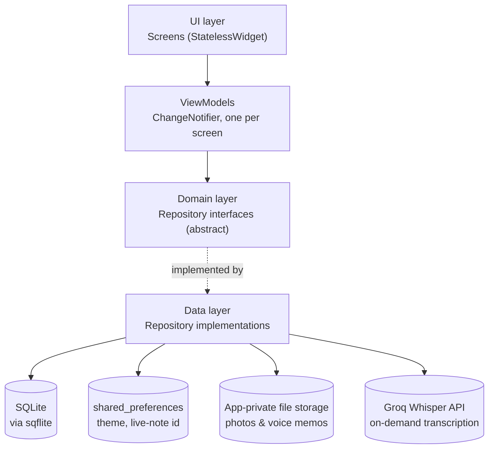
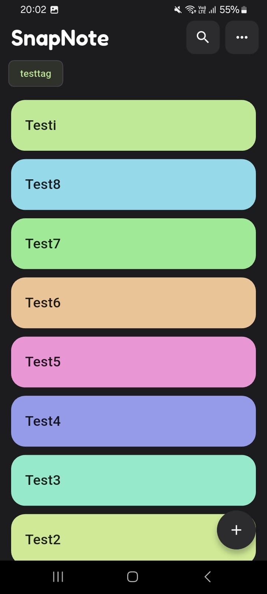
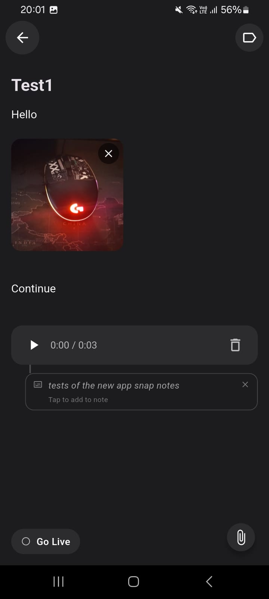
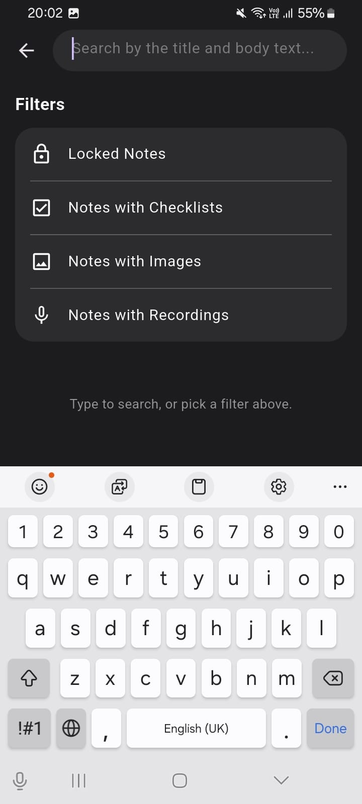
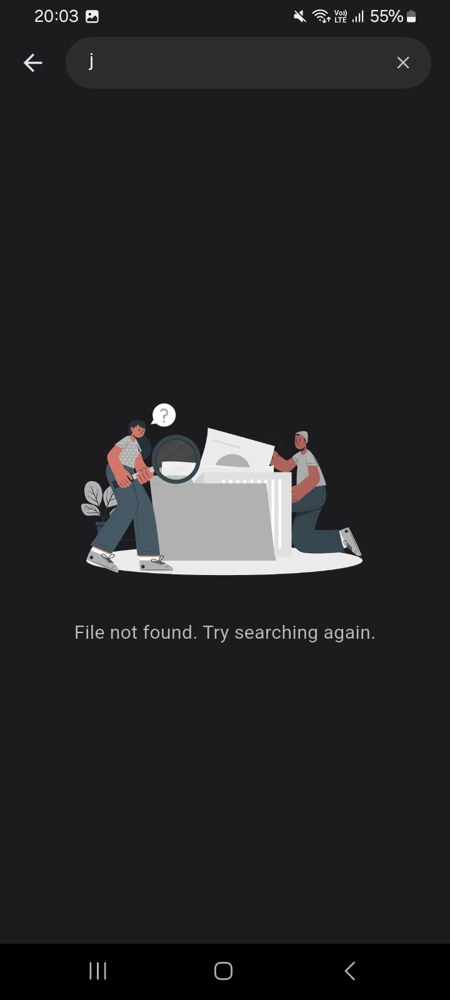
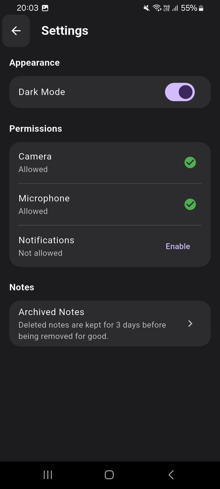
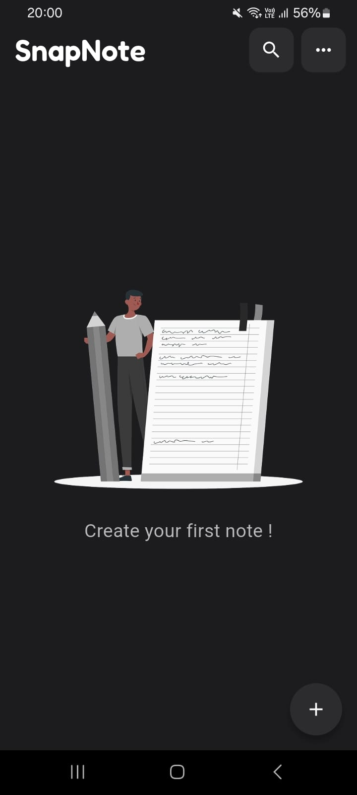

# SnapNote

A notes app for text, photos, and voice memos — built with Flutter for the Mobile Internship Graduation Project (Team 5).

A note isn't just a wall of text: photos and voice memos sit *inline* with the text, in whatever order you added them, with real selection-based rich text (bold/italic/underline/checklists) on top.

## Features

- **Rich note editing** — text, photos, and voice memos live together in one note, with real selection-based bold/italic/underline/checklist formatting (powered by `flutter_quill`)
- **Photos** — take a photo in-app or pick one from the gallery
- **Voice memos** — record, play back, and delete, with a live duration display; optional on-demand transcription (via Groq's Whisper API) that can be inserted into the note as text
- **Search** — across note titles and body text, plus filters for locked notes, notes with checklists, notes with images, and notes with recordings
- **Tags** — create and filter by tags, each with its own color
- **Pin, lock, and share** — pin notes to the top, lock a note against edits, share a note as text and images
- **Swipe to delete, with Undo** — a 4-second undo window, then the note moves to Archived Notes for 3 days before being purged for good
- **Light/dark theme**
- **Go Live** — pin a note to the lock screen as an ongoing notification (Mohamed's own stretch idea, inspired by iOS Live Activities — not a graded requirement)

## Architecture

Three layers, with dependency injection via the `provider` package — no screen talks to the database directly.



- **`lib/domain/`** — models (`Note`, `Tag`) and abstract repository interfaces. No Flutter or `dart:io` imports — this layer doesn't know how data is actually stored.
- **`lib/data/`** — concrete implementations: `NoteRepositoryImpl`/`TagRepositoryImpl` (SQLite via `sqflite`), `SettingsRepositoryImpl` (`shared_preferences`), `GroqTranscriptionService` (HTTP), `LocalNotificationLiveNoteService` (`flutter_local_notifications`).
- **`lib/ui/`** — screens and `lib/ui/view_models/` — one `ChangeNotifier` ViewModel per screen, each exposing a `status` enum (`loading`/`empty`/`error`/`success`) that the screen switches on.

Every ViewModel receives its repository dependencies through its constructor, typed as the abstract interface — real implementations are created once in `main.dart` via `MultiProvider`, which is also what makes ViewModels testable against fake repositories (see `test/`).

A note's content — text, photos, and voice memos, all inline — is stored as a single Quill Delta document (`Note.quillJson`). `Note.body`/`photoPaths`/`voiceMemoPaths` are derived getters computed from that document, not separate stored fields.

## Getting started

**Prerequisites**: Flutter SDK (3.13+), an Android SDK with at least one emulator or a physical device with USB debugging enabled.

```bash
git clone https://github.com/mohamedamrsabry/snapnote.git
cd snapnote
flutter pub get
```

**Voice memo transcription (optional)** needs a Groq API key:

1. Copy `env.example.json` to `env.json`
2. Fill in your key: `{ "GROQ_API_KEY": "your-key-here" }`
3. `env.json` is gitignored — never commit it

**Run:**

```bash
# With transcription enabled
flutter run --dart-define-from-file=env.json

# Without (transcription will show a "not configured" message, everything else works)
flutter run
```

VS Code users: two launch configs are already set up in `.vscode/launch.json` ("SnapNote (with API key)" / "SnapNote (no API key)").

**Run the tests:**

```bash
flutter test
```

## Screenshots

| | |
|---|---|
|  Home screen |  Note with a photo, voice memo, and Go Live |
|  Search filters |  Search — empty state |
|  Settings |  Home screen — empty state |

## Known limitations

- **iOS is untested.** Development happened entirely on Windows with no Mac available, so build/testing only ever happened on Android (emulator and a real device). The codebase doesn't use any Android-only APIs, but the iOS build has never actually been run.
- **Voice memo playback can be silent on some Android emulator configurations** — recording captures real audio correctly (duration and metadata read back fine), but a handful of emulator setups don't route audio output. This hasn't reproduced on a real device; it looks like an emulator quirk, not an app bug.
- **Transcription requires an internet connection and a Groq API key.** Without a key configured, the transcribe button shows a clear "not configured" message rather than failing silently.
- **Archived notes are purged opportunistically**, not on a background schedule — an archived note past its 3-day window gets swept the next time the home screen or Archived Notes screen loads, not the instant it expires.
- **Go Live is an ongoing notification, not a true iOS-style Live Activity** — a real Live Activity needs a Swift Widget Extension built via Xcode, which isn't possible without a Mac. This is the closest Android equivalent, and isn't a graded requirement.
- **Downsized images are only downsized in memory at display time**, not re-compressed on disk — the original full-resolution file is still what's stored (this is deliberate: it keeps the "delete a note removes its files" guarantee simple, at the cost of some disk space for large photos).
